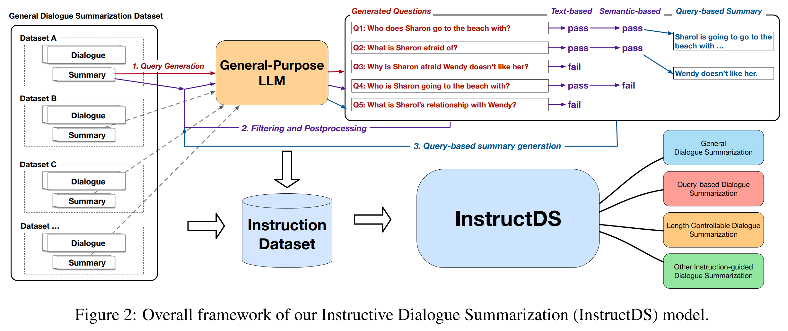

# InstructDS: Instructive Dialogue Summarization with Query Aggregations

[](#python)
[](https://arxiv.org/abs/2310.10981)
[](https://aclanthology.org/2023.emnlp-main.474/)

[\[**EMNLP 2023 Slides**\]](content/EMNLP2023-InstructDS.pdf), 
[\[**Paper**\]](https://arxiv.org/abs/2310.10981), 
[\[**Training and Evaluation Code**\]](https://github.com/BinWang28/InstructDS_Train), 
[\[**Poster**\]](content/poster.pdf), 
[\[**Dataset**\]](https://huggingface.co/datasets/binwang/InstructDS_datasets)

Dialogue summarization framework described in the paper [Instructive Dialogue Summarization with Query Aggregations](https://arxiv.org/abs/2310.10981) (EMNLP 2023). This part is for `training and evaluation`. The demo part can be found at: [InstructDS](https://github.com/BinWang28/InstructDS)


<p align="center">
  
</p>

# Framework

<p align="center">

</p>

# Requirements

- Python 3.10

```
pip install -r requirements.txt
```


# Training

```
bash train.sh
```


# Evaluation

```
bash evaluation.sh
```


## Citation
```
@inproceedings{wang-etal-2023-instructive,
    title = "Instructive Dialogue Summarization with Query Aggregations",
    author = "Wang, Bin  and
      Liu, Zhengyuan  and
      Chen, Nancy",
    editor = "Bouamor, Houda  and
      Pino, Juan  and
      Bali, Kalika",
    booktitle = "Proceedings of the 2023 Conference on Empirical Methods in Natural Language Processing",
    month = dec,
    year = "2023",
    address = "Singapore",
    publisher = "Association for Computational Linguistics",
    url = "https://aclanthology.org/2023.emnlp-main.474",
    pages = "7630--7653",
}
```

```
@misc{wang2023instructive,
      title={Instructive Dialogue Summarization with Query Aggregations}, 
      author={Bin Wang and Zhengyuan Liu and Nancy F. Chen},
      year={2023},
      eprint={2310.10981},
      archivePrefix={arXiv},
      primaryClass={cs.CL}
}
```
